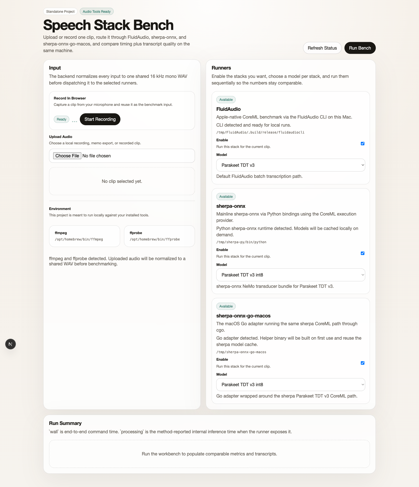
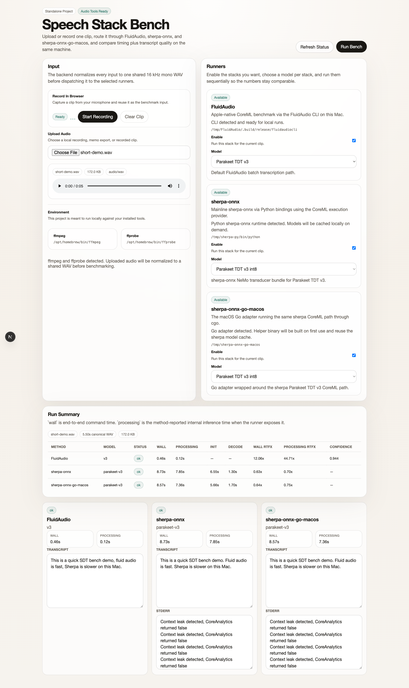

# stt-bench

Local UI for benchmarking speech-to-text stacks against the same audio on the same Mac.

Right now it compares:

- `FluidAudio`
- `sherpa-onnx` through Python
- `sherpa-onnx-go-macos`

You can upload a clip or record directly in the browser, route that input through any combination of the three runners, and compare speed, transcript quality, and stderr noise side by side.

## Quick Start

Requirements:

- macOS
- `bun`
- `ffmpeg`
- `ffprobe`
- at least one local STT runner installed

Install dependencies:

```bash
bun install
```

Start the app:

```bash
bun run dev
```

Open:

```text
http://localhost:3011
```

## Demo


## Screenshots

### Overview



### Comparison Results



## What It Does

For each run, the app:

1. Takes an uploaded file or a browser recording
2. Normalizes it to a shared `16 kHz` mono WAV
3. Runs the selected methods sequentially
4. Shows metrics and transcripts in the same view

The result cards include:

- wall time
- processing time when the runner exposes it
- init and decode timings for sherpa runs
- real-time-factor estimates
- transcript output
- raw stderr output

The progress bar in the UI is an estimate based on the selected runners and their prior wall times. The backend returns one final response when the full benchmark completes.

## Runners

### FluidAudio

Runs the local FluidAudio CLI on macOS. By default the app looks for:

- `STT_BENCH_FLUIDAUDIO_CLI_PATH`
- `/tmp/FluidAudio/.build/release/fluidaudiocli`

Supported models in the UI:

- `v3`
- `v2`
- `tdt-ctc-110m`

### sherpa-onnx

Runs the mainline `sherpa-onnx` Python path with the CoreML execution provider. By default the app looks for:

- `STT_BENCH_SHERPA_PYTHON_PATH`
- `/tmp/sherpa-py/bin/python`
- `/tmp/sherpa-py/bin/python3`

Supported models in the UI:

- `parakeet-v3`
- `parakeet-v2`

### sherpa-onnx-go-macos

Runs the macOS Go adapter against the same sherpa model bundle and CoreML path. By default the app looks for:

- `STT_BENCH_SHERPA_GO_REPO_PATH`
- `/tmp/sherpa-onnx-go-macos`

Notes:

- the Go helper binary is built on first use
- the Go path reuses the sherpa model cache
- the Go runner still depends on the sherpa Python runtime to materialize model files locally

## Configuration

Optional environment variables:

```bash
export STT_BENCH_FLUIDAUDIO_CLI_PATH="/absolute/path/to/fluidaudiocli"
export STT_BENCH_SHERPA_PYTHON_PATH="/absolute/path/to/python"
export STT_BENCH_SHERPA_GO_REPO_PATH="/absolute/path/to/sherpa-onnx-go-macos"
```

## API

The app exposes one local API route at `/api/bench`.

`GET /api/bench`

- reports `ffmpeg` and `ffprobe` availability
- reports whether each runner is available
- returns detected paths and model cache roots when available

`POST /api/bench`

- accepts `multipart/form-data`
- requires an `audio` file field
- requires a `runs` field containing JSON like:

```json
[
  { "method": "fluid", "model": "v3" },
  { "method": "sherpa-python", "model": "parakeet-v3" },
  { "method": "sherpa-go", "model": "parakeet-v3" }
]
```

## Development

Type-check:

```bash
bun run type-check
```

Production build:

```bash
bun run build
```

## Notes

- This is a local benchmarking tool, not a hosted transcription service.
- The browser recorder uses `MediaRecorder`, so the raw recorded file type depends on browser support.
- The sherpa CoreML path can emit Apple/CoreML stderr noise such as `Context leak detected, CoreAnalytics returned false`. The app currently shows those lines instead of filtering them out.

## License

MIT. See [LICENSE](LICENSE).
